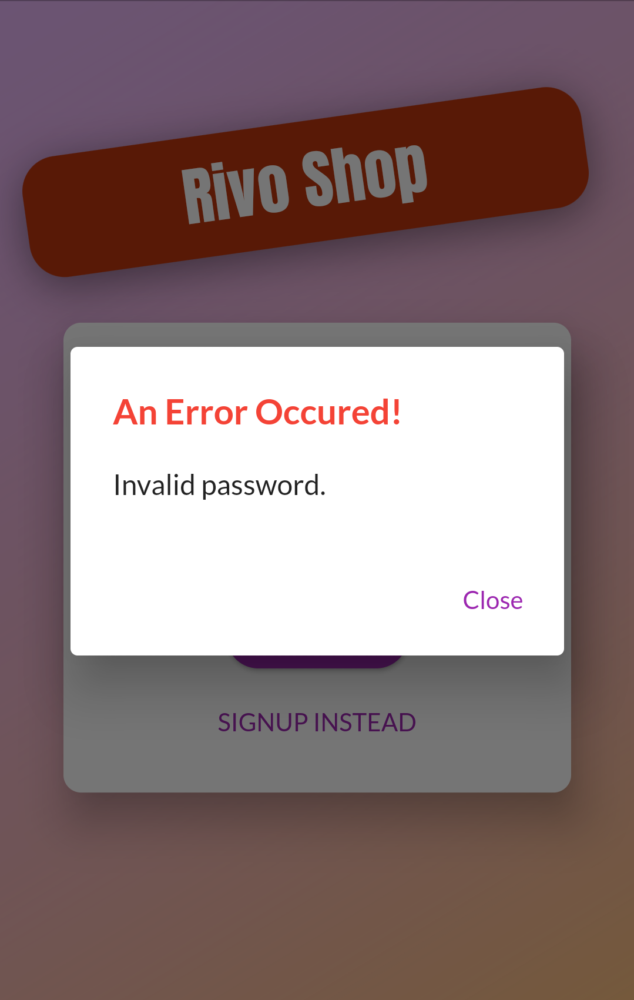

# RIVO Shop
Browse many products and order what you want.
 

## Table of contents
* [General info](#general-info)
* [Technologies](#technologies)
* [Launch](#launch)
* [Setup](#setup)
* [Example of use](#example-of-use)

 
 

## General info
1. Login / Register with validation
2. Browse all products or only favorite products and click on to show details
3. Add product to cart / Swipe to remove from cart
4. Add product to favorite
5. Add new product / Edit an existing product
6. View all orders you made from one place
7. Add product's image from your local phone

 

## Technologies
Project is created with:
* Dart as programming language
* Flutter as framework of Dart
* State Management using [Provider](https://pub.dev/packages/provider "Provider package")

 

## Launch
1. connect you real device / emulator (Android) / simulator (IOS)
1. open lib folder
2. run [main.dart](lib/main.dart)

 

## Setup
1. visit [Flutter](https://flutter.dev/docs/get-started/install "Flutter setup page")
2. choose your operating system
3. follow the instructions to install Flutter successfully
4. install [provider package](https://pub.dev/packages/provider/install "Provider package installation")
5. install [shared preferences package](https://pub.dev/packages/shared_preferences/install "Shared preferences package installation")
6. install [intl package](https://pub.dev/packages/intl/install "Intl package installation")
7. install [image-picker package](https://pub.dev/packages/image_picker/install "Flutter image picker package installation")
8. install [http package](https://pub.dev/packages/http/install "Http package installation")
9. install [firebase storage package](https://pub.dev/packages/firebase_storage/install "Firebase storage package installation")
10. install [firebase core package](https://pub.dev/packages/firebase_core/install "Firebase core package installation")

 

## Example of use
 

<ul>
  <li>
    <h5>Authentication</h5>
    

    <table>
      <tr>
        <th>Sign-In</th>
        <th>Sign-Up</th>
      </tr>
      <tr>
        <td></td>
        <td></td>
      </tr>
    </table>
  </li>
  <li>
    <h5>Auth validation</h5>
    

    <table>
      <tr>
        <th>Sign-In (Empty fields)</th>
        <th>Sign-Up (Empty fields)</th>
      </tr>
      <tr>
        <td></td>
        <td></td>
      </tr>
      <tr>
        <th>Sign-In (Incorrect password)</th>
        <th>Sign-Up (Email already exist)</th>
      </tr>
      <tr>
        <td></td>
        <td></td>
      </tr>
    </table>
  </li>
  <li>
   <h5>Side Menu</h5>
   

   
  </li>
  <li>
    <h5>Home / Shop</h5>
    

    <table>
      <tr>
        <th>All products</th>
        <th>Switch home screen</th>
        <th>Only favorite products</th>
      </tr>
      <tr>
        <td></td>
        <td></td>
        <td></td>
      </tr>
    </table>
  </li>
  <li>
    <h5>Favorite</h5>
    

    <table>
      <tr>
        <th>Empty favorite</th>
        <th>Item in Favorite</th>
      </tr>
      <tr>
        <td></td>
        <td></td>
      </tr>
    </table>
  </li>
  <li>
    <h5>Cart</h5>
    

    <table>
      <tr>
        <th>Empty cart</th>
        <th>Add item to cart</th>
        <th>Item in cart</th>
      </tr>
      <tr>
        <td></td>
        <td></td>
        <td></td>
      </tr>
      <tr>
        <th>Delete item from cart</th>
        <th>Delete confirmation</th>
      </tr>
      <tr>
        <td></td>
        <td></td>
      </tr>
    </table>
  </li>
  <li>
   <h5>Orders</h5>
   

   <h4>Orders you made with some details</h4>
   
  </li>
  <li>
    <h5>Your products</h5>
    

    <table>
      <tr>
        <th>You don't add product yet</th>
        <th>You added product</th>
      </tr>
      <tr>
        <td></td>
        <td></td>
      </tr>
    </table>
  </li>
  <li>
    <h5>Add / Edit product</h5>
    

    <table>
      <tr>
        <th>Add product</th>
        <th>Validate product fields</th>
        <th>Edit product</th>
      </tr>
      <tr>
        <td></td>
        <td></td>
        <td></td>
      </tr>
    </table>
  </li>
  <li>
   <h5>Item details</h5>
   

   <h4>And you can click on product to show details</h4>
   
  </li>